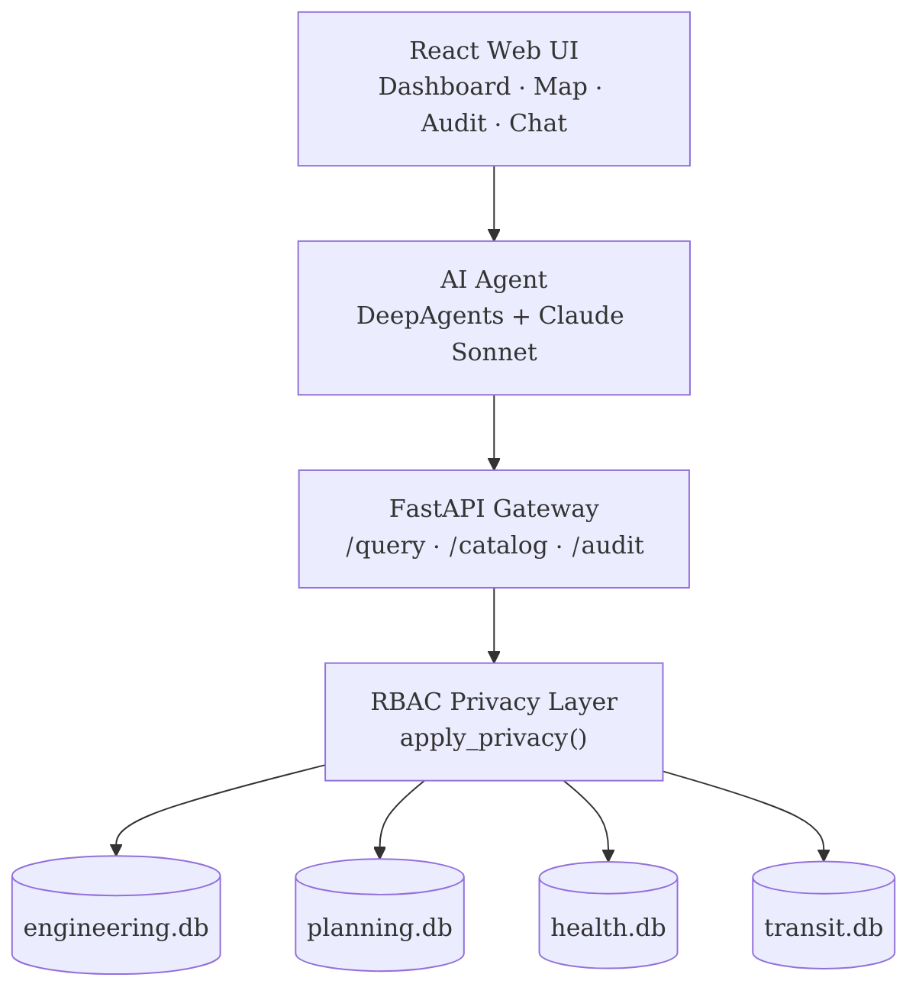

Last Sunday, my team and I participated in the Future Cities Institute x LangChain hackathon that took place at the University of Waterloo. We had 6 hours to build a solution to address a data fragmentation problem that has plagued the Waterloo-Kitchener region, and other cities, for a long time. We came up with CityMind, a federated data layer for municipal governments that lets city departments share data across silos while keeping each department in control of their own data. This post is about how we built it and what we learned, but first let's talk about the problem.

# the problem
The prompt was something like: "Design the secure data nervous system that lets planning, transit, engineering, and health finally think as one city." The obvious interpretation is "plumbing problem". Departments have data, the data isn't connected, so we need to build the pipe. Our first two approaches went in that direction, using Tavily to query public city websites, aggregating what we could find. This wasn't enough. We realized that the framing was excluding a core part of the problem: the fact that departments don't trust each other with their data. Departments won't hand over raw data because they'd be giving up control of it, and there's no agreed-upon answer to "who can see what" across departments. There's no record of who accessed data. Without that, accountability is basically impossible. Any integration attempt turns into a political negotiation. There's no real incentive to share data efficiently, and no mechanism to ensure that data is shared responsibly.

A concrete example of this is the Region of Waterloo pausing housing development. Engineering and planning data were isolated to their respective departments. Planners couldn't track water capacity, so they couldn't safely approve permits. This played a huge role in the eventual decision to pause development.<a href="#ref-1" id="ref-1-back">[1]</a>

# the design
CityMind doesn't centralize the data. The individual departments don't have to migrate their data into a warehouse. The architecture is a federated hub-and-spoke.

1. Each department registers their dataset in a shared catalog.
2. CityMind holds a governed local copy (replicated from source).
3. Every query passes through a privacy gateway that applies role-based access rules before returning anything.
4. Every query, approved or denied, is written to an immutable audit log.

The privacy layer is what makes departments willing to participate. They keep control of their data, and the gateway enforces the rules. That's the core idea the whole system is built around.

# the architecture
The stack has four layers: a custom React frontend, a LangGraph AI agent running Claude Sonnet, a FastAPI gateway where all privacy enforcement happens, and four department databases. We built it so that everything goes through the gateway. You can't hit a database without going through the privacy layer first.

The frontend is a full custom React app (Vite, React Router) that we built from scratch. The sidebar has three sections: governance tools (data quality dashboard, shared data dictionary, live audit log), data tools (a dataset explorer, a cross-department analysis interface with a role selector, a citizen portal, and a Leaflet map rendering real geometry), and an admin panel for managing sync runs. There's a floating chat widget in the bottom-right corner of every page that POSTs to the AI backend and renders responses inline.

The important design point is that governance isn't just a feature of the chat interface. The map view, the cross-analysis page, and the chat widget all hit the same FastAPI endpoints with the same RBAC rules applied. No exceptions.

We also wired in real open data from the City of Kitchener and Region of Waterloo ArcGIS portals: 107,460 building permits, 20,163 water mains, and 1,178 bus stops. Sync runs are idempotent and tracked, so you can re-run them safely.

# the privacy layer
This is the part that took the most careful thought. Most systems handle privacy procedurally. You tell people not to query certain fields, add a terms-of-service checkbox, and trust that the rules will be followed. We wanted it to be structurally impossible to retrieve data you're not authorized for.

The gateway runs `apply_privacy()` before any data leaves the system. The AI agent goes through this endpoint and there's no way around it. How you phrase the query doesn't change what you get back. The access matrix is fairly intuitive: an engineer gets full access to engineering data but only a sanitized read-level view of planning, and nothing from health at all. A planner gets aggregated engineering capacity as bands (Low / Medium / High / Critical), not raw percentages. A health official gets full health indicators but only zone-level summaries from planning. Each role gets what it needs for the job and nothing more.

We also implemented small-cell suppression. If a filtered query returns fewer than five records in a zone, the result is withheld entirely and flagged in the audit log. This blocks a class of re-identification attacks where a sufficiently narrow question lets you deduce individual records from what looks like aggregate data. It's the kind of detail that comes up in serious privacy engineering and usually gets cut in a hackathon. We kept it.

Every query, approved or blocked, wrote a row to the audit log: requester role, department, zone filter, access level applied, record count, and whether suppression was triggered. Audit logs are retained seven years. Suppressed query attempts are kept permanently. We exposed this through a `GET /audit` endpoint as a live governance dashboard, so city administrators could see in real time exactly what their data was used for. The whole system is politically defensible in a way that "trust the AI" never would be.

# what it looks like in practice
Say you ask, as a planner: "What is the water infrastructure readiness for the Uptown Waterloo corridor?"

The agent calls `catalog_tool` to identify which datasets are relevant, then `query_tool` against engineering, planning, and transit with `role=planner`. Engineering returns capacity as bands. Planning returns full permit data. Transit returns ridership and frequency in full. The agent's system prompt requires it to call `audit_tool` as the last step, so governance is baked in as a hard requirement rather than something that can be skipped. The response shows the access level applied to each data source alongside the results.

Natural language in, governed structured data out, audit trail on every interaction. The agent isn't making anything up. It called real endpoints and returned what the privacy layer allowed through.

# what those six hours taught us
The code was the easy part. The hard part was the first two hours, when we were building the wrong thing. V1 and V2 treated the problem as a connectivity problem. Once we understood it was fundamentally a trust problem, the architecture almost designed itself. You need a catalog so departments know what data exists. You need a privacy layer so they feel safe registering it. You need an audit log so the whole arrangement is politically credible. Everything else followed from that.

The tech stack, Python, FastAPI, SQLite, LangGraph, Claude, React, is nothing exotic. What made the project interesting was one constraint we imposed on ourselves: every surface in the system runs on top of the same governance layer, with no exceptions. That one decision made the rest of it coherent. And it's probably the only version of this idea that would actually work in a real city.

 

# references
<ol class="references">
    <li id="ref-1">CBC News. <a href="https://www.cbc.ca/news/canada/kitchener-waterloo/region-waterloo-water-capacity-quantity-concerns-no-new-development-approvals-9.7035505" target="_blank" rel="noopener">"Region of Waterloo pauses development approvals over water capacity concerns"</a> <a href="#ref-1-back" aria-label="back to content">↩</a></li>
</ol>
